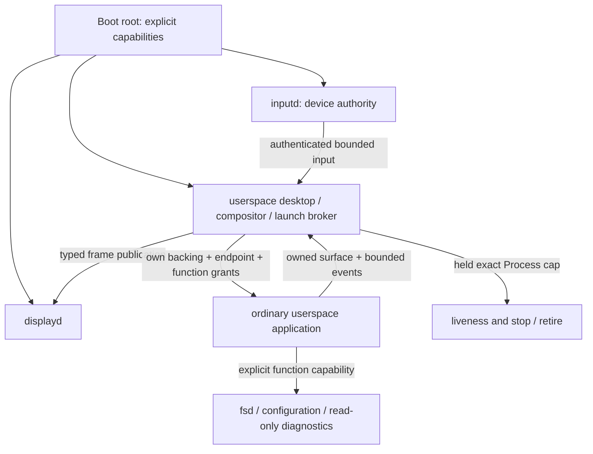

# Phase 10 design handoff

Status: NOT READY. Phase-10 engineering is in progress. This is the handoff
contract, not a qualified baseline or authorization to change service internals.

The exact qualified baseline commit, artifact hashes, suite count and 100/100
receipt must be recorded here before the Opus design branch starts.

## Architecture and editing boundary

Names, PIDs, window handles and visual placement never confer authority.
Presentation must remain in `userspace/ui` and app view/layout files. Opus may
edit tokens, components and presentation after the qualified checkpoint. Kernel,
IPC, lifecycle, fsd/configd/packaged, input transport and display architecture
require engineering review. Record missing primitives in DESIGN-REQUESTS.md.

## Required checkpoint inventory

- Exact Sol baseline commit and branch; diagram updated to implemented topology.
- Every app's screenshot and deterministic gallery capture with hashes.
- Drawing primitives, XRGB/framebuffer details and alpha support status.
- Font, icon/image, pointer, keyboard and window-management capabilities.
- Monotonic motion primitives, frame scheduling and preference behavior.
- Measured surface/owner/region/process/cap limits and supported resolutions.
- Token paths, presentation files safe to edit, protected mechanism files.
- Known visual limitations; UI-only test commands and screenshot instructions.
- Full qualification receipt and independently extracted graphical bundle proof.

No screenshot or Phase-10 capability is claimed by this initial contract.
