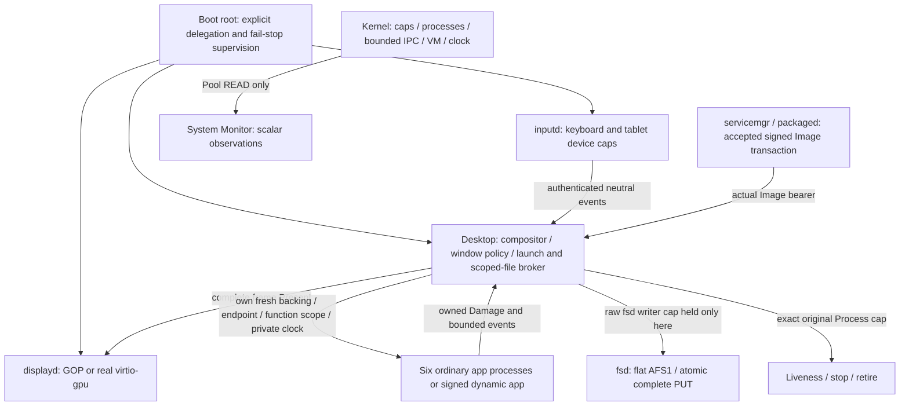

# Sol → Opus design handoff

Sol engineering/reference skin. Qualified executable/test/tool source:
`11a45c34deae9a7a539a99fd7d3d6ea196ea6025`. Engineering branch: `arena/phase10-sol-engineering`.
Full suite **97/97**; fresh exact-image graphical gate **100/100**.
EFI SHA-256: `18357914fbfca7c7af87bd846c0f12f645e7f9a78d4816395d688b295ba90c7f`.
The published preservation checkpoint adds only handoff docs and evidence to
this qualified source; executable/test/tool changes invalidate those receipts.
Archive checksum, independent extracted-boot receipt, resource measurements and
screenshots are in `releases/checkpoints/phase10-engineering-baseline/`.
Independent extracted graphical boot passed. Archive SHA-256:
`86c4853269b8e3475b205191ff6a80c20f096afe3609ee9dd049042b628592f8`.
Opus branches from the published preservation checkpoint with this exact
executable/test/tool tree. This is the design handoff, not final Phase-10 visual
qualification. Sol must review and requalify the post-Opus image.

The frozen host bundle helper has an argv-handling limitation documented in
checkpoint `PACKAGING.md`. Use its tested `VERIFY-EXTRACT.py`, or run the
standalone script directly inside an extracted archive. Opus leaves tools and
qualification mechanisms to Sol; the packaged script and guest are qualified.

## Architecture



Names, PIDs, startup view kind, window IDs and visual placement confer no
execution, resource or filesystem authority. APP-CONTRACTS.md describes grants.

## Apps and screenshot inventory

Terminal, Files, Editor, Settings, System Monitor and UI Gallery are distinct
ordinary processes, built from a statically linked multicall ELF. Generic
signed Image applications use the same owned graphics/liveness topology.
Every app, light/dark desktop, six-app desktop and light/dark owned gallery has
an actual guest PNG reference. SCREENSHOT-MANIFEST.md describes the fixture;
checkpoint `screenshot-manifest.json` records source/EFI and each PNG checksum.
Only the owned gallery crop is a deterministic golden. Full desktop captures
include real uptime and diagnostic values; semantic tests use structural pixels.

## Drawing capabilities

Opaque 32-bit XRGB8888 pixels (little-endian B,G,R,unused byte); Canvas has
clipped rectangles, borders, pixel writes, opaque raster blits and bitmap text.
Alpha blending, blur, antialiasing, paths, image decoders and GPU effects are
absent. Do not assume a PNG in this handoff can be decoded by the guest.
Geometry/icon rasters are Arena-authored and assembled from rectangles.

The Arena-owned font is 5x7 ASCII, including distinct lowercase, with integer
scale 1..3, clipping and a 6x8 base cell. Current body scale is 1, title scale 2.
There is no Unicode shaping, proportional font, font loader or Apple asset.
Changing typography beyond the existing primitive needs an engineering request.

## Windows, input and motion

Six sessions each own one window, max 448x288, min 80x60, and a 127-page backing.
Titles are at most 32 bytes. Highest-z hit testing, click focus/to-front, title
bar drag, clipping and a retained visible title above the dock support screen edges. Close
queues an owned event; dirty Editor offers save/discard/cancel. Repeated Close
force-stops an unresponsive exact child. Death reaps its original Process and
backing. No minimize, maximize, resize or live compositor restart is offered.

The real QEMU virtio tablet supplies absolute motion and left/right/middle
button state. Clients get local bounded events and press/release capture, never
raw device capabilities. US keyboard supports ASCII/Shift, backspace/Enter/Tab,
Escape, arrows, Home/End/Delete. F1..F6 launch, F7 cycles focus, F8 closes.
There is no clipboard, shortcut modifier framework, key repeat guarantee or
POSIX terminal. Keyboard-only boot also has the production Desktop.

Shared integer Motion supports current/target, retargeting, linear and smooth
interpolation over the monotonic clock. Production uses reveal for open/close,
chrome focus interpolation and bounded 20ms scheduling. Motion can be disabled
and persisted. Gallery exposes 0/50/100% samples and focus/disabled/refused states.
No independent per-app decorative animation loops or compositor alpha exist.

Only authenticated Damage publishes a private complete owned snapshot. Input
redraws reuse that snapshot. GOP Present copies scanout synchronously without
vsync/page-flip; a screenshot can catch a copy in progress. Capture settled
owned regions. Multi-writer/multi-core publication is outside this contract.

## Measured bounds and display matrix

Tested common modes: GOP800x600, real virtio-gpu800x600 and virtio-gpu640x480.
Six real windows are exercised in all three. The source supports bounded mode
validation; other resolutions are not qualified by this matrix.

Six-app GOP: 20 processes/records, seven regions, 1231 shared pages, 14 mappings,
28 steady broker caps and 29 transient caps. GPU800: eight regions/1233 pages/
15 maps; GPU640: eight/1064/15. Backings total 762 pages. Private complete-frame
snapshots reserve 756 more resident broker pages. Exact free-frame minima are
recorded by the final full-suite resource receipts. Four unretired dynamic
children are allowed system-wide, independently of six desktop sessions.
Kernel limits are eight regions, 2048 shared pages, 512 pages/region, 32 mappings,
32 cap slots/process, 24 spawn records, 32 processes and 25 notifications.
Six warmed intermediate page tables remain resident under existing unmap policy;
repeated full cycles return exact warmed accounting.

## Safe presentation sources

- `userspace/ui/src/theme.rs`: light/dark palette and visual tokens.
- `userspace/ui/src/metrics.rs`: typography, spacing, chrome/dock dimensions.
- `userspace/ui/src/motion.rs`: shared interpolation/duration tokens.
- `userspace/ui/src/components/mod.rs`: reusable controls, icons and gallery.
- `userspace/desktop/src/shell.rs` (was `desktop_view.rs`; moved into the
  library by the maturity pass, ADR-0070): background, top bar, dock.
- `userspace/desktop/src/compose.rs`: retained scene, damage and composition
  order (engineering-owned; presentation changes must keep its region rules).
- `userspace/desktop/src/apps/view.rs`: pure application raster views.
- `userspace/desktop/src/apps/layout.rs`: shared layout/hit rectangles, viewport
  dimensions, caret position and visual rows.

These views contain no filesystem, process, IPC or native syscall work. Keep
layout/hit testing consistent and dimensions within the measured backing limit.
Motion algorithm invariants and layout semantics must still pass host tests.

## Engineering review required

Do not silently modify kernel/VM/capability/IPC/spawn/Image bookkeeping;
`userspace/desktop/src/bin/desktop.rs`, `app_client.rs`, `scope.rs`, wire codecs,
fs_backend.rs or app models/controllers; fsd, package/config/permission services;
inputd/displayd drivers; boot delegation/build profiles; signing/package/disk
formats; qualification, lifecycle or authority test oracles. Tests may need new
interaction coordinates after a reviewed layout change, but resource/authority/
actual-input invariants must remain. Add missing primitives to DESIGN-REQUESTS.md.

## Current visual and product limits

The reference skin has neutral light/dark surfaces, simple geometric icons,
small ASCII bitmap text, opaque borders and restrained motion. No decorative
hardware status exists. Uptime is monotonic, not wall time. There are no fake
folders, unsupported toggles, Power in graphical apps, POSIX terminal or larger
signed packages. Flat `user-*` files and 4096-byte text are deliberate limits.
Menus/popups, scrollbars, shadows with alpha, wallpaper/image decoding and richer
font primitives need engineering work before they can be drawn faithfully.

## UI-only checks and deterministic capture

With the pinned Rust/QEMU environment loaded, run from repository root:

```sh
python3 tools/test_m10_ui.py
python3 tools/test_m10_handoff.py
python3 tools/test_m10_desktop.py
python3 tools/test_m10_keyboard.py
python3 tools/test_m10_apps.py
python3 tools/test_m10_files.py
python3 tools/test_m10_display.py
```

Guest suites run sequentially because they share fixed host-peer ports/build
fixtures. `test_m10_handoff.py` builds the explicit production profile, formats
AFS1, boots the historical fixture, seeds known text and canonical light/motion-
disabled preference, then launches each real app and uses QMP `screendump` after
owned-raster settling. Pointer parks at 780,500. It emits lossless RGB PNGs and
`build/phase10-screenshots/manifest.json`. Owned 448x288 gallery crops at 70,60
must match byte-for-byte across an independent boot; local `t` supplies the dark
component palette fixture. The actual dark desktop comes from persisted Settings.
Host gallery PPMs are supplementary fixtures, not guest proof.

After Opus finishes, Sol reviews architecture/resource/performance and performs
all historical tests, a new exact-EFI 100/100 and a new final deployable archive.
The engineering baseline does not replace that post-design qualification.

## Captured application references

- [Terminal](../../releases/checkpoints/phase10-engineering-baseline/screenshots/terminal.png)
- [Files](../../releases/checkpoints/phase10-engineering-baseline/screenshots/files.png)
- [Text Editor](../../releases/checkpoints/phase10-engineering-baseline/screenshots/editor.png)
- [Settings](../../releases/checkpoints/phase10-engineering-baseline/screenshots/settings.png)
- [System Monitor](../../releases/checkpoints/phase10-engineering-baseline/screenshots/monitor.png)
- [UI Gallery](../../releases/checkpoints/phase10-engineering-baseline/screenshots/gallery.png)
- [Full six-app desktop](../../releases/checkpoints/phase10-engineering-baseline/screenshots/desktop-six-apps.png)
- [Deterministic gallery, light](../../releases/checkpoints/phase10-engineering-baseline/screenshots/gallery-owned-light.png)
- [Deterministic gallery, dark](../../releases/checkpoints/phase10-engineering-baseline/screenshots/gallery-owned-dark.png)

Every PNG checksum is in [SCREENSHOT-MANIFEST.md](SCREENSHOT-MANIFEST.md).

## Opus design pass (O → S/M/C)

Branch `arena/phase10-opus-design`, parent
`9095b0f380bb5c2293b85b7e49e3ca3388d248b8`, design source
`cf311719e08d07cf765d7799524bce7067bd8419`. Full return:
[OPUS-DESIGN-RETURN.md](OPUS-DESIGN-RETURN.md). Requests:
[DESIGN-REQUESTS.md](DESIGN-REQUESTS.md) DR-01..DR-14. New guest references:
`releases/checkpoints/phase10-opus-design/` (see SCREENSHOT-MANIFEST.md).
This is not qualification; Sol requalifies the post-design image.

The Sol reference skin is replaced by the ArenaOS visual system, still
confined to the safe presentation sources listed above:

* `theme.rs` — semantic **Paper** (light) and **Ink** (dark) palettes with
  one teal Signal accent, strong/soft state tones, console, editor, pointer
  and six application identity tiles; a host test enforces contrast for
  every text role in both palettes. `elevated` and `palette()` keep their
  compositor-facing meaning.
* `metrics.rs` — 2px grid, spacing steps, control/row/line heights, radii,
  window anatomy (`HEADER_BOTTOM`, `FOOTER_Y`), shell presentation sizes.
  Window-policy geometry is unchanged.
* `motion.rs` — documented motion language; focus 100ms (was 80ms), open
  120ms and close 90ms unchanged, `Smooth` curve unchanged.
* `components/` — split into `text` (Body/Strong/Caption/Display styles on
  the 5x7 face), `shapes` (opaque rounded/stadium primitives that leave
  corners unpainted), `controls` (button kinds, field, row, switch, meter,
  chip, status band, focus ring, caret), `icons` (original one-bit app and
  interface glyphs, emblem, pointer, focus lamp), `chrome` (single window
  chrome used by both compositor and clients) and `gallery`.
* `desktop_view.rs` (now `shell.rs`) — plain field with the Arena emblem and real key hints,
  wordmark system bar with focused app, real window count and labelled
  uptime, error toast, floating dock with identity tiles, names, hover,
  focused/running indicators and capacity dimming, new pointer.
* `apps/view.rs`, `apps/layout.rs` — shared window anatomy (title, header
  band, content, status band) for all six applications; every tested
  interaction point and the editor text origin are preserved and asserted
  by `layout::tests`.

Guest semantic suites pass unchanged on the design source; the only oracle
edit is the three host-gallery pixel pairs in `test_m10_ui.py`, moved to the
same semantic features in the new gallery layout. Two guest runs exposed
oracle regions the design had touched (the cascade title probe over the
Terminal header in `test_m10_boundaries_red`, and the editor's
dialog/document synchronisation regions in `test_m10_files`); both were fixed
in presentation and pinned by host unit tests (see OPUS-DESIGN-RETURN.md,
oracle-sensitivity findings).

Opus guest references (design source, hashes in SCREENSHOT-MANIFEST.md):
[desktop light](../../releases/checkpoints/phase10-opus-design/screenshots/desktop-light.png),
[desktop dark](../../releases/checkpoints/phase10-opus-design/screenshots/desktop-dark.png),
[Terminal](../../releases/checkpoints/phase10-opus-design/screenshots/terminal.png),
[Files](../../releases/checkpoints/phase10-opus-design/screenshots/files.png),
[Text Editor](../../releases/checkpoints/phase10-opus-design/screenshots/editor.png),
[Settings](../../releases/checkpoints/phase10-opus-design/screenshots/settings.png),
[Settings dark](../../releases/checkpoints/phase10-opus-design/screenshots/settings-dark.png),
[System Monitor](../../releases/checkpoints/phase10-opus-design/screenshots/monitor.png),
[UI Gallery](../../releases/checkpoints/phase10-opus-design/screenshots/gallery.png),
[six-app desktop](../../releases/checkpoints/phase10-opus-design/screenshots/desktop-six-apps.png),
[owned gallery light](../../releases/checkpoints/phase10-opus-design/screenshots/gallery-owned-light.png),
[owned gallery dark](../../releases/checkpoints/phase10-opus-design/screenshots/gallery-owned-dark.png).

To look at the design interactively: `bash tools/run-desktop.sh` from the
repository root boots the checksummed prebuilt development image
(`releases/checkpoints/phase10-opus-design/prebuilt/`, QEMU + Python 3 only)
in a QEMU window, or VNC on localhost:5901 when the QEMU build has no window
backend. `--build` rebuilds from the checkout first; `--fresh` starts with a
new disk. Not a qualified image.
