# Opus design return — ArenaOS Phase 10

From O (Opus, visual/UI/motion design) to M, C and S.
This is a design handoff, **not** Phase-10 qualification. Sol reviews and
integrates this branch, then runs the complete historical suite and a new
exact-EFI 100/100 on the post-design image.

## Provenance

| Item | Value |
|---|---|
| Branch | `arena/phase10-opus-design` |
| Exact parent (Sol engineering baseline) | `9095b0f380bb5c2293b85b7e49e3ca3388d248b8` (`phase10-engineering-baseline`) |
| Design source commit (all code; screenshots captured from it) | `cf311719e08d07cf765d7799524bce7067bd8419` |
| Opus final SHA | the branch head; later commits add only docs and screenshot evidence. The final report to M/C/S names it. |
| Baseline engineering EFI (not reproduced here) | `18357914fbfca7c7af87bd846c0f12f645e7f9a78d4816395d688b295ba90c7f` |
| Screenshot capture EFI (dev build of the design source) | `d2b6068c8d4e6a48cc482e54cde30664e18fbd0a15f53e2614f6c0dfe0a8eed4` (also in `releases/checkpoints/phase10-opus-design/screenshot-manifest.json`) |

The capture EFI is a fresh development build of the design source; it is
not a qualified shipping image and its hash is evidence only.

## Design philosophy

ArenaOS should feel *precise, calm and honest*. Three rules drove every
decision:

1. **One system, many surfaces.** All colour comes from semantic tokens, all
   geometry from metrics/layout, all drawing from one component library that
   the compositor, every application and the Gallery share. The Gallery has
   no private rendering path.
2. **State is never colour alone.** Focus, selection, disabled, refusal,
   unsaved and activity each carry a second, non-colour cue (shape, weight,
   glyph, position, border style).
3. **Show only what is real.** No decorative hardware indicators, no fake
   wall clock, no folders, no CPU graphs, no toggles that do nothing. Where a
   fact is real (window count, uptime, memory frames, caret line:column,
   scrollback depth) it is shown plainly.

The identity motif is the **arena**: a stadium track seen from above. It
appears as the empty-desktop emblem; the system bar carries only the
`ArenaOS` wordmark (a small capsule mark there could be misread as a battery
indicator, which ArenaOS does not have). One teal **Signal** accent marks
focus and the recommended action everywhere.

## Palette and light/dark system

Two designed palettes share one set of roles (`userspace/ui/src/theme.rs`):

* **Paper** (light): cool white material (`#fdfdfe` content, `#f0f3f5`
  header) on a steel-blue field (`#4d6474`); ink text `#141a21`; Signal
  `#0e7c77`.
* **Ink** (dark): graphite material (`#161d25` content, `#1c242e` header) on a
  blue-black field (`#0b1015`); text `#e4eaef`; Signal `#2fb3a9`.

Ink is not an inverted Paper: its accent is lighter and brighter, its soft
tones are deep tints (`accent_soft #153a39`), its error/warning/success are
lifted for dark surfaces, and its disabled text is calibrated separately.
Roles: desktop (field, mark, hint text), bar, dock (panel, edge, well),
pointer (ink, fill), window material (elevated, header, divider, frame,
frame_focus, shadow), text (text, secondary, muted, disabled), Signal accent
(accent, strong, soft, on_accent), state tones (error/warning/success, each
strong + soft), controls (control, edge, field, edge, track, sidebar),
console (terminal, text, muted, prompt, edge), editor (current line, caret)
and six application identity tiles plus `on_tile`.

`theme::tests::legible_roles_in_both_palettes` enforces WCAG-style contrast
in both palettes: body text >= 7:1 on every window surface, secondary
>= 4.5:1, muted >= 3:1, accent-on-soft and state-on-soft pairs, console text,
tile glyphs >= 3:1, and disabled visibly weaker than muted. It caught two
real issues during the pass (Ink desktop hint text and the Ink Files tile).

## Spacing, shape and anatomy

`metrics.rs`: 2px base grid; working steps 4/8/12/16/24 (`S/M/L/XL/XXL`);
control height 24, list row 20, line height 14; radius 2 (controls) and 3
(panels). Rounded shapes leave corner pixels unpainted so the surface
beneath shows through — honest rounding with no alpha.

Every application window shares one anatomy (`apps/layout.rs`):

```
0..28    title bar           (compositor chrome)
28..66   header band         toolbar or page header (header material)
66       divider
67..264  content
264..288 status band         tone glyph + caption text
```

## Typography

Only the Arena 5x7 bitmap face exists. Four styles (`components/text.rs`):

| Style | Construction | Use |
|---|---|---|
| Body | scale 1, advance 6 | running text, values, console, editor |
| Strong | double-struck (1px horizontal emboldening), advance 7 | titles, names, emphasis, selected rows |
| Caption | upper-case, advance 7 | section labels, status lines, eyebrows |
| Display | scale 2, advance 12 | primary figures (Monitor memory) |

Controller status strings arrive in capitals; rendering them as Caption
makes that a deliberate typographic role. Window titles moved from scale 2
to Strong at scale 1 (calmer, more room). `text_fit` truncates with `..`.

## Icon language

Original one-bit masks authored in `components/icons.rs` (~0.4 KiB):

* **Application glyphs** 16x16 on rounded identity tiles: Terminal (chevron
  + Signal cursor on graphite), Files (stacked flat sheets — deliberately no
  folder), Editor (page + I-beam), Settings (two switches), Monitor (three
  meters), Gallery (component swatches). Solid forms with knocked-out
  detail; a secondary half-tone layer adds depth.
* **Interface glyphs** 9x9: close, plus, save, rename, open, refresh,
  delete, document, chevron, and the status set — error (disc with `!`),
  warning (diamond with `!`), success (disc with check), idle (ring). Shape
  alone distinguishes the four status glyphs.
* **Pointer**: an original notched arrowhead, ink outline with light fill,
  hot spot at the tip.

## Window chrome rules

Square frame (the compositor cannot see under a corner, so it never fakes
rounding). Focus is shown five ways at once, cross-faded by the shared focus
motion: a 2px Signal rail on the top edge, the focus lamp (filled disc vs
hollow ring), frame tone (Signal vs neutral), title ink (text vs secondary),
and a deeper opaque drop ledge (3px vs 1px) that doubles as a stacking cue.
The close well sits centred in the unchanged 28px close strip and is always
visible. The title bar shares the header material with the app's own header
band, so title and toolbar read as one unit.

## Dock rules

The dock hit strip (56px tall, 58px per item, centred) is unchanged; inside
it floats a rounded panel. Each slot: 26px identity tile, full application
name (8 characters max), and an indicator row: a 14px Signal bar under the
focused app, one 2px dot per running instance otherwise. Hover (real
pointer position from window policy) draws a well. When all six desktop
sessions are in use, tiles dim, because any launch would be refused.

## System-bar rules

Left: `Arena` + Signal `OS` wordmark, divider, the focused application's
identity chip and title (or `Desktop`). Right: `WINDOWS n/6` (real session
count; warning tone at capacity) and `UPTIME h:mm:ss` (monotonic; labelled so
it cannot be mistaken for a clock). Nothing else. Shell notices (capacity
refusal) appear as an error toast under the bar with the error glyph.

## Component rules

* Buttons: Standard, Primary (one per surface; Editor's Save is always
  Primary), Destructive (error-tone label + glyph). States: focused =
  2px Signal ring; selected = soft fill + strong label; disabled = dotted
  outline + disabled ink; refused = error soft fill, error edge and glyph.
* Fields: focused = 2px ring + I-beam caret; refused = error edge plus a
  leading error bar; disabled = dotted.
* Rows: selected = Signal leading bar + soft fill + Strong label; refused =
  error glyph + tone; disabled = disabled ink.
* Switch: knob position and fill both encode state; Settings also prints
  `On`/`Off`.
* Meter/progress: stadium track + fill; ratios are always real.
* Chips: caption text on soft tone (or outlined neutral).
* Status band: tone glyph + caption; error and warning tint the band.

## Application notes

* **Terminal** — full-bleed console in both palettes (distinct shades), page
  header listing the real commands, real `n/32 LINES` scrollback depth and a
  `BACK n` chip when viewing history, a dedicated input line with Signal
  chevron prompt and block caret. Error lines produced by the controller
  (`REFUSED...`) render in error tone, unknown-command hints in warning tone.
  Command/result distinction awaits DR-02.
* **Files** — flat namespace stated by design: a file count, never a path or
  folder. Sidebar list pane with document glyphs and Strong selection;
  preview card with name and real byte length; empty state explains that New
  creates an empty `user-*` file; Open/Delete render disabled with no files;
  Delete is destructive-toned. Create uses the shared dialog (field + Primary
  + Cancel).
* **Text Editor** — full-bleed text canvas with current-line highlight and
  rail, I-beam caret, header document facts (name or `Untitled`, a
  right-aligned `Unsaved` / `On disk` / `New` chip, real line:column).
  Save is the constant Primary action.
  Dirty close offers `Save changes` (Primary) / `Discard` (Destructive) /
  `Cancel`. Empty documents state the real limit (ASCII up to 4096 bytes).
* **Settings** — the clearest statement of the system: page header, grouped
  preference card with two switch rows whose descriptions state the current
  real effect, and a read-only Display facts card (resolution from the real
  display reply, pixel format, type). Fixes the baseline overlap where the
  motion button covered the display label.
* **System Monitor** — only real counters: memory frames in use (total −
  free) as a Display figure with a real ratio meter, six kernel-object
  stats, real uptime, and a striped PID/threads list with a numeric visible
  range when it overflows.
* **UI Gallery** — buttons (kinds x states), fields, sidebar rows, console
  sample, switches, progress/meter, status chips, focused/resting chrome
  swatches, the real `Smooth` curve plotted from `Motion::sample` over the
  real `OPEN_US`, and the six application tiles. `T` still flips the local
  palette.

## Motion language

Motion only explains state change (`motion.rs`). Enter 120ms (frame
appears, content unrolls), exit 90ms (shorter than entrance), focus 100ms
(was 80ms: five 20ms frames so the rail/lamp/frame cross-fade is
perceptible). All use the existing `Smooth` curve and collapse to zero when
the persisted motion preference is off. No per-app animation loops were
added. Dock motion, theme cross-fade and reveal-aware chrome are requests.

## Files changed

Presentation (safe surfaces): `userspace/ui/src/{theme,metrics,motion}.rs`;
`userspace/ui/src/components/{mod,text,shapes,controls,icons,chrome,gallery}.rs`
(module split of the former single `mod.rs`);
`userspace/desktop/src/desktop_view.rs`;
`userspace/desktop/src/apps/{view,layout,mod}.rs` (`mod.rs`: descriptive
window titles and dock labels only).

Test oracle (coordinates only): `tools/test_m10_ui.py` — the three host
gallery structural pixel pairs now point at the new gallery's plain/selected
row, normal/focused button edge and console/panel boundary. Same semantics,
no weakening.

Interactive launcher (added at M's request, new file only; no existing
tool changed): `tools/run-desktop.sh` boots the checksummed prebuilt image in
`releases/checkpoints/phase10-opus-design/prebuilt/` (QEMU + Python only) or,
with `--build`, a fresh build of the checkout.

Docs/evidence: `docs/phase10/{DESIGN-HANDOFF,DESIGN-REQUESTS,SCREENSHOT-MANIFEST,OPUS-DESIGN-RETURN}.md`,
`releases/checkpoints/phase10-opus-design/`.

## Visual assets added

No raster files are loaded by the guest. Icon and pointer masks are `const`
one-bit arrays compiled from readable string grids in `icons.rs`; the emblem
is procedural (stadium spans). All are original.

## Engineering files deliberately untouched

Kernel; capability/IPC/spawn/Image code; `userspace/desktop/src/bin/{desktop,application,gallery}.rs`;
`app_client.rs`, `client.rs`, `scope.rs`, `model.rs`, `preferences.rs`,
`fs_backend.rs`, all wire codecs; `apps/model.rs`; fsd, configd, package,
permission, input and display services; gfxkit; boot delegation and build
profiles; signing/package/disk formats; every lifecycle, authority and
resource test oracle. Window-policy geometry shared with `model.rs`
(`TITLE_HEIGHT`, `CLOSE_WIDTH`, `DOCK_*`, `SYSTEM_BAR_HEIGHT`, window size,
cascade, visible-title width) is unchanged. All controller hit rectangles
contain the same interaction points as before (`layout::tests` asserts the
tested points), and the editor text origin stays at `EDIT_TEXT + 6`.

## Unresolved design limitations

Square windows; opaque drop ledges read as hard edges over other windows;
one bitmap face; ASCII-only punctuation; no close hover/press; no pressed
buttons; no dock/theme motion; tone inferred from controller strings; no
per-row file sizes; Terminal cannot style echoed commands; content cannot
dim when its window is inactive. Each has a request below.

## Requests requiring Sol/C review

`DESIGN-REQUESTS.md` DR-01..DR-14: typed status tone, terminal echo marking,
file sizes in FilesView, chrome pointer state, reveal-aware chrome, dock
motion, client focus flag, pressed state, darken/blend primitive, rounded
window corners, second type size/bold face, Unicode punctuation, scroll
position, theme cross-fade.

## Targeted tests run (design source `cf31171`)

Run sequentially in this container (pinned Rust 1.97.0, QEMU 11.0.2 via
`tools/dev-env/bootstrap.sh`), all on the unmodified design source:

| Suite | Result | Notes |
|---|---|---|
| `test_m10_ui.py` (host) | PASS | fmt, lib tests (incl. new contrast, layout-interaction and two oracle-region tests), strict Clippy lib+bins, no_std release, deterministic host gallery |
| `test_m10_handoff.py` | PASS | all twelve references captured; owned light/dark gallery byte-identical across an independent boot |
| `test_m10_files.py` | PASS | select/read/open/delete, duplicate-create refusal, 4096-byte bound, Save As, unsupported-file refusal |
| `test_m10_boundaries_red.py` | PASS | 12/12 production mutants rejected by real guest oracles; byte-exact restore; GREEN |
| `test_m10_desktop.py` | PASS | dock spawn, owned raster, key, drag, close, relaunch |
| `test_m10_keyboard.py` | PASS | F1..F6, F7, F8, keyboard-only |
| `test_m10_apps.py` | PASS | six real apps, live theme on all six (>80% pixel change), persistence across boot, capacity refusal, exact cleanup |
| `test_m10_display.py` | PASS | GOP800, GPU800, GPU640 six-app pressure |
| `test_m10_boundaries.py` | PASS | audits, pointer activation, exact drag/cleanup |
| `test_m10_dynamic.py` | PASS | four signed dynamic apps, unpublished staging invisible, dock-safe title |
| `test_m10_client_death.py` | PASS | sibling survives, forced close; mutant restored byte-exact |
| `test_m10_archive_preflight.py` | PASS | |
| `test_m10_clock_sampling.py` | PASS | |
| `test_m10_multi_red.py` | PASS | |
| `test_m10_replace.py` / `test_m10_replace_red.py` | PASS | |
| `test_m10_select_failure_cleanup.py` | PASS | |
| `test_m10_service_death.py` | PASS | |

Not run by Opus: the complete historical suite (`tools/run_tests.sh`), the
shipping image build and the exact-EFI 100/100 stability loop. Those are
Sol's post-design qualification.

All host checks in `test_m10_ui.py` (fmt, unit tests including the new
palette-contrast and layout-interaction tests, strict Clippy for lib and
bins, no_std release builds, deterministic host gallery) pass. Earlier
intermediate runs of the same guest suites also passed. Nothing was
skipped, disabled or weakened.

## Resource / performance implications

Measured release ELF `PT_LOAD` sizes, baseline -> Opus:

| ELF | text+rodata | data/bss |
|---|---|---|
| desktop (compositor) | 42,552 -> 44,731 (+2.2 KiB) | 3,100,880 -> 3,100,816 |
| application (multicall, per app process) | 40,794 -> 56,971 (+15.8 KiB, ~4 pages) | 12,720 -> 12,720 |
| gallery (standalone ELF) | 16,448 -> 24,640 (+8 KiB) | — |

Guest accounting is otherwise identical: six-app peak processes/records/
regions/pages/maps/steady caps `20/20/7/1231/14/28` (GOP800), `8/1233/15`
regions/pages/maps on GPU800 and `8/1064/15` on GPU640, transient broker caps
29, exact teardown everywhere. Free frames are lower only by the larger
images (final run vs Sol's receipts): idle 113,699 vs 113,706; six-app peak
GOP800 112,733 vs 112,764, GPU800 112,285 vs 112,315, GPU640 112,622 vs
112,666. That is 30-44 frames (about 120-176 KiB) at six apps, consistent
with ~4 extra pages per application image plus small run-to-run variance. No new buffers, caches, assets or allocations. Per-frame cost: the
desktop emblem adds about 300 span fills per composite (only when the
compositor already redraws); dock hover redraws ride the existing pointer
redraw. Windows' drop ledges add two rectangles each.

## Oracle-sensitivity findings during the pass

Two complete guest runs on intermediate design commits each exposed a place
where a new visual detail sat inside a region a guest oracle uses as a
signal. Both were fixed in the presentation layer, both are now pinned by
host unit tests that were shown RED on the faulty layout, and no oracle was
edited.

### 1. Cascade title probe (test_m10_boundaries_red)


The first complete guest run on the design source failed
`test_m10_boundaries_red`: its `readonly-diagnostic-grant` mutant was not
rejected. Cause: that oracle recognises "Monitor never opened" by a plain
title strip where the third cascaded window would appear — screen
134..314 x 116..125, which lies over the Terminal's local rows 56..65. The
baseline left those rows blank; the new Terminal page header's second line
and header divider crossed them, so the absent window read as present.
The fix is presentation-only (header divider moved to y66, page-header
lines to y35/y48) and is pinned by
`apps::view::tests::terminal_header_keeps_cascade_probe_strip_plain`
(verified RED on the previous layout, GREEN now). The oracle itself was not
touched. Recommendation for Sol/C: harden `Desktop.opened()` to also
require the launch count/new-title evidence, so oracle sensitivity no longer
depends on what an underlying window happens to draw.

### 2. Editor synchronisation regions (test_m10_files)

`test_m10_files` failed with "Save As did not commit exact 4096-byte
document". The suite waits for the editor text area to change (document
loaded) and for the toolbar strip x12..366/y36..60 to change (dialog open)
before typing. Keyboard and tablet events travel on separate virtio queues,
so those waits are the only ordering between a click and the keys after it.
The design had hidden the empty-document placeholder while a dialog was
open (text area changed before the document loaded; the captured frame shows
the Open dialog half-typed) and varied the toolbar strip with the dirty flag
(Primary Save, `Unsaved` chip). Either let a wait pass early, so the Save As
name could be typed into the document. Fix: placeholder independent of
dialog state, Save constantly Primary, saved-state chip and caret position
right-aligned outside the strip. Pinned by
`apps::view::tests::editor_probe_regions_change_only_for_their_events`
(RED for each hazard separately, GREEN now). Recommendation for Sol/C: a
reviewed input-ordering barrier (or an explicit dialog-open serial marker)
would remove this class of hidden coupling between visuals and oracles.

## What Sol should inspect before merging

1. `tools/test_m10_ui.py` coordinate change (three pixel pairs), and the
   two oracle-sensitivity findings above.
2. `apps/layout.rs`: `FILE_LIST` now starts at x8 and rows are 20px (row 0
   still contains the tested point; the controller computes rows from
   `ROW_H`), `APPEARANCE`/`MOTION` are full-width rows (tested points
   unchanged), `TERMINAL_ROWS` 11 and `MONITOR_ROWS` 11 (both used by the
   controllers for scroll bounds).
3. `view::tone` string classification (DR-01) — presentation only.
4. Window titles changed (`Terminal`, `UI Gallery`, ...). The standalone
   `bin/gallery.rs` still connects as `ArenaOS UI Gallery`; it was left
   untouched as an engineering file.
5. The ~16 KiB application image growth above.
6. Capture EFI differs from the qualified baseline EFI by design; requalify.

Kernel, capability, IPC, filesystem, package and display authority
architecture was **not** changed by this pass.

## Screenshots

Real guest QMP captures (hashes in SCREENSHOT-MANIFEST.md):

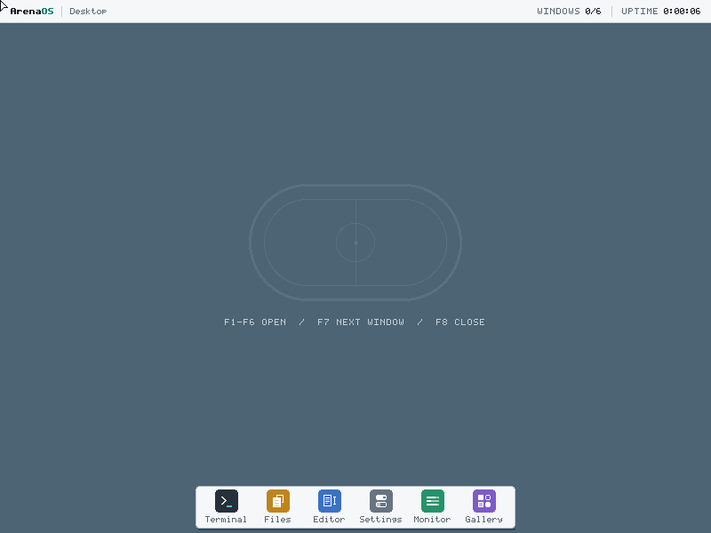
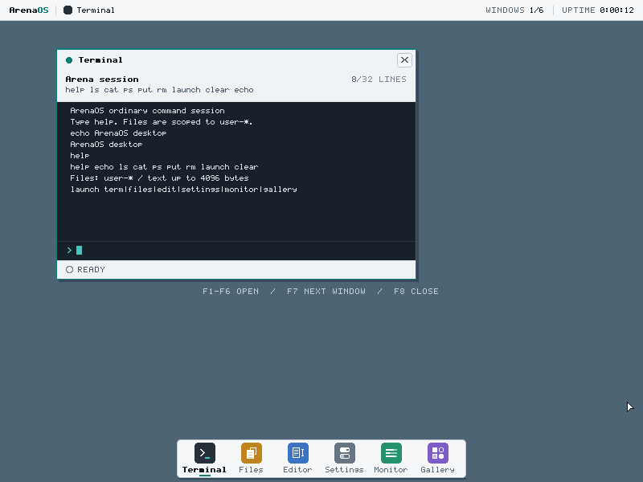
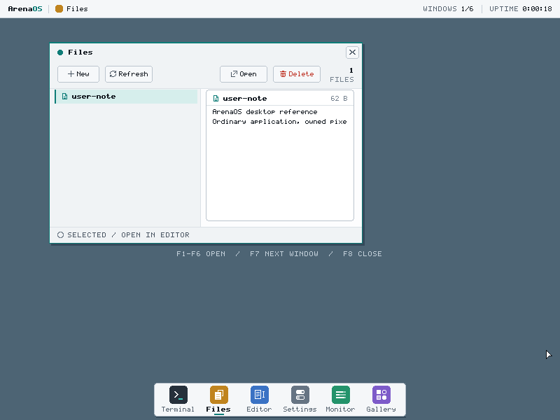
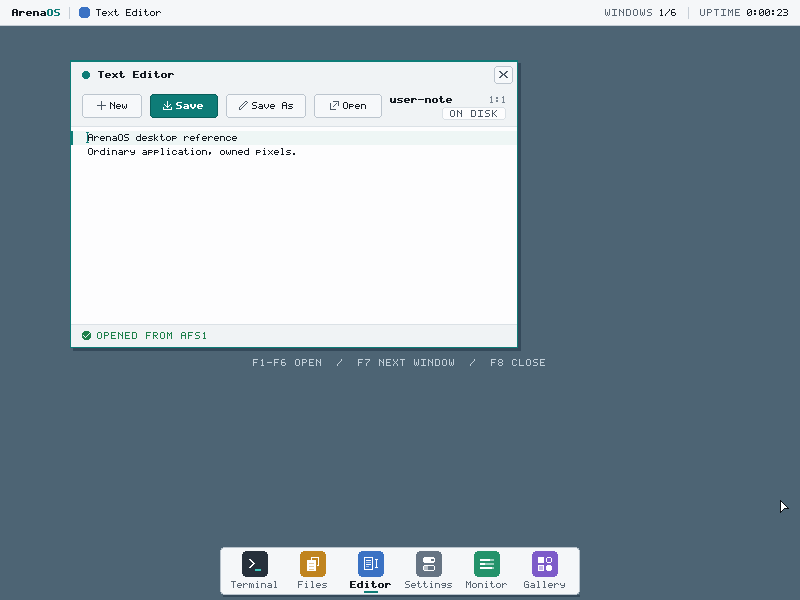
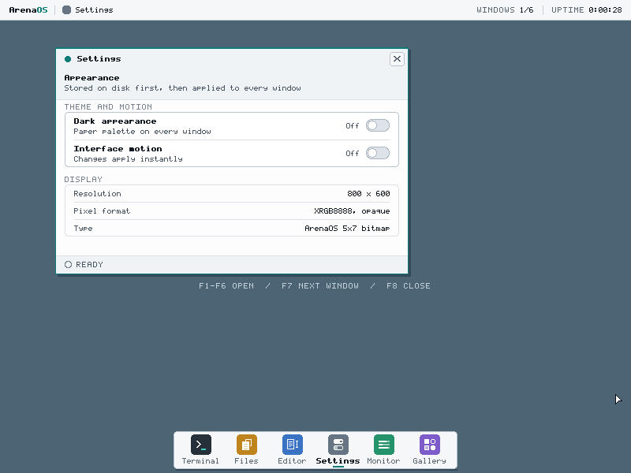
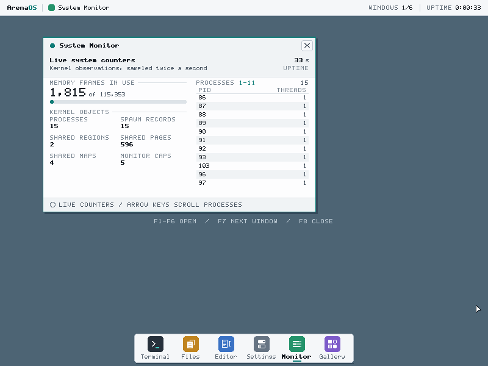
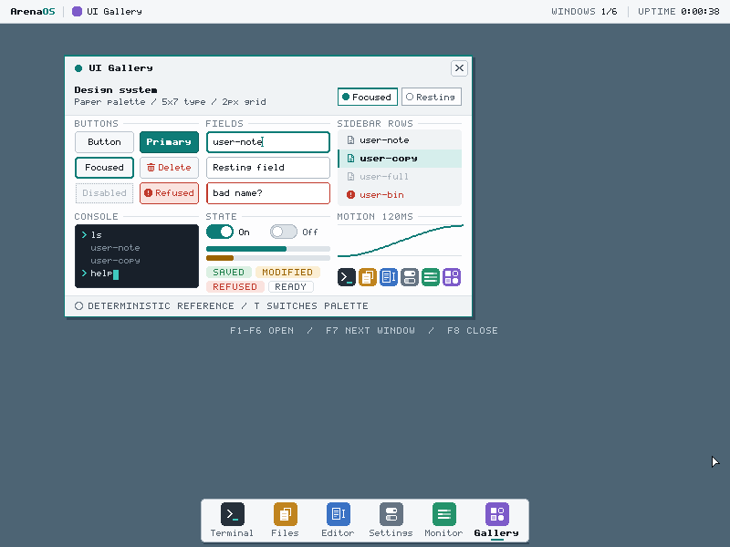
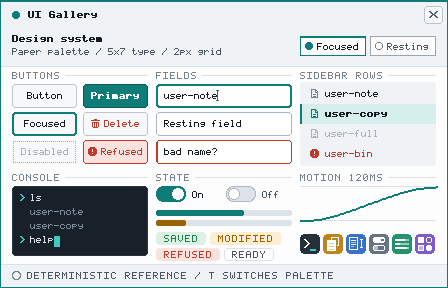
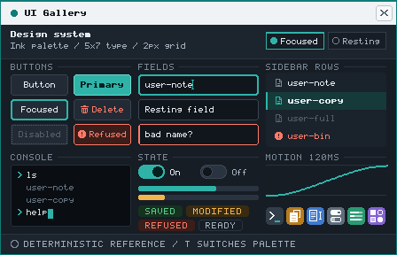
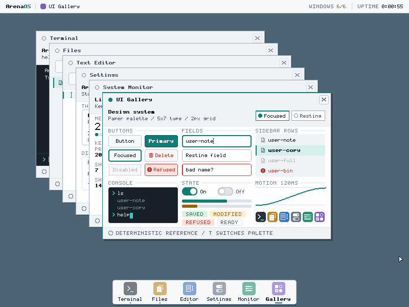
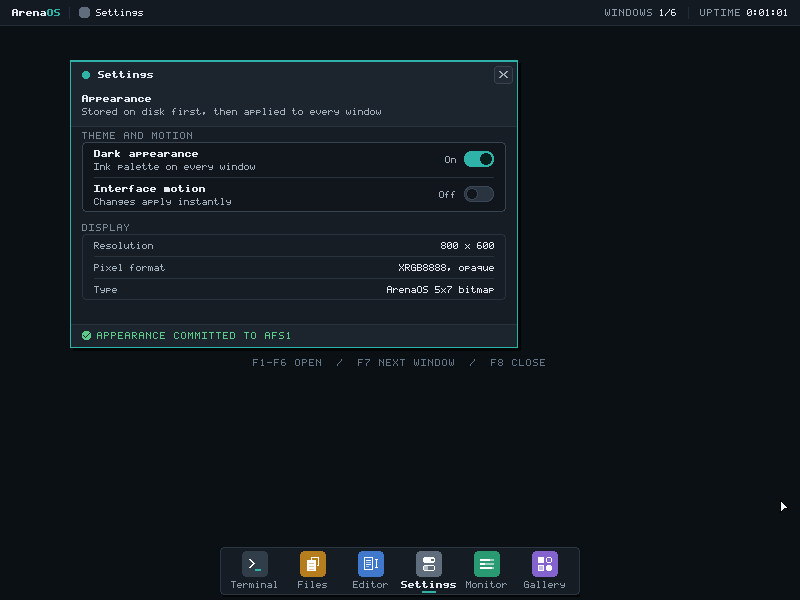
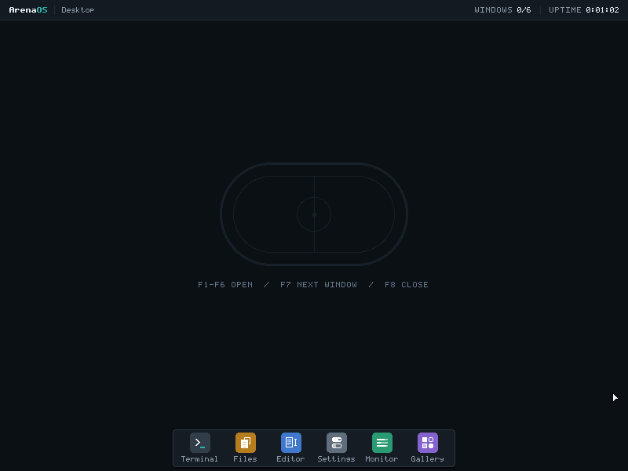
